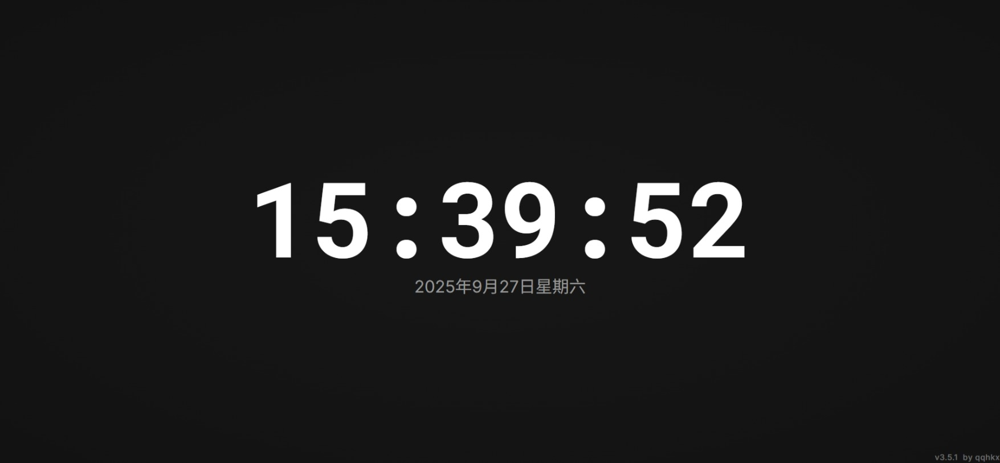
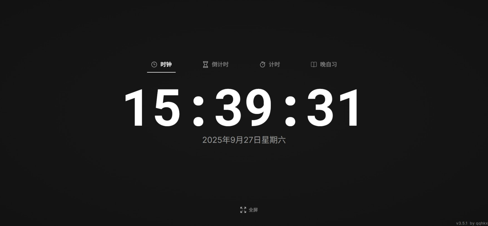
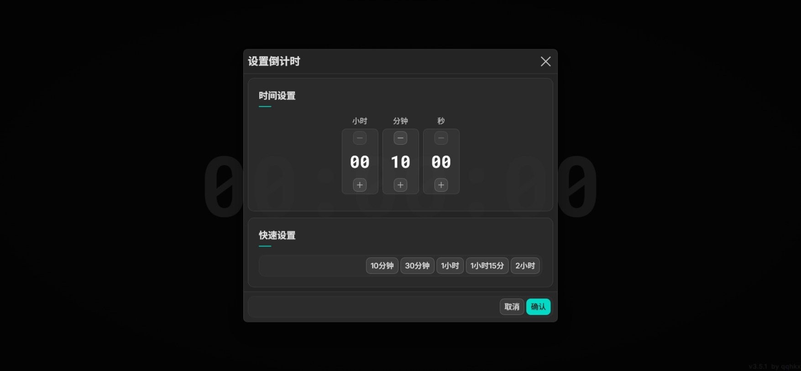
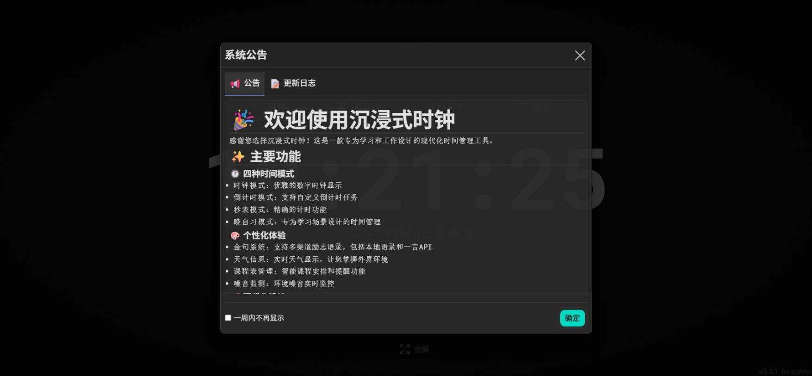
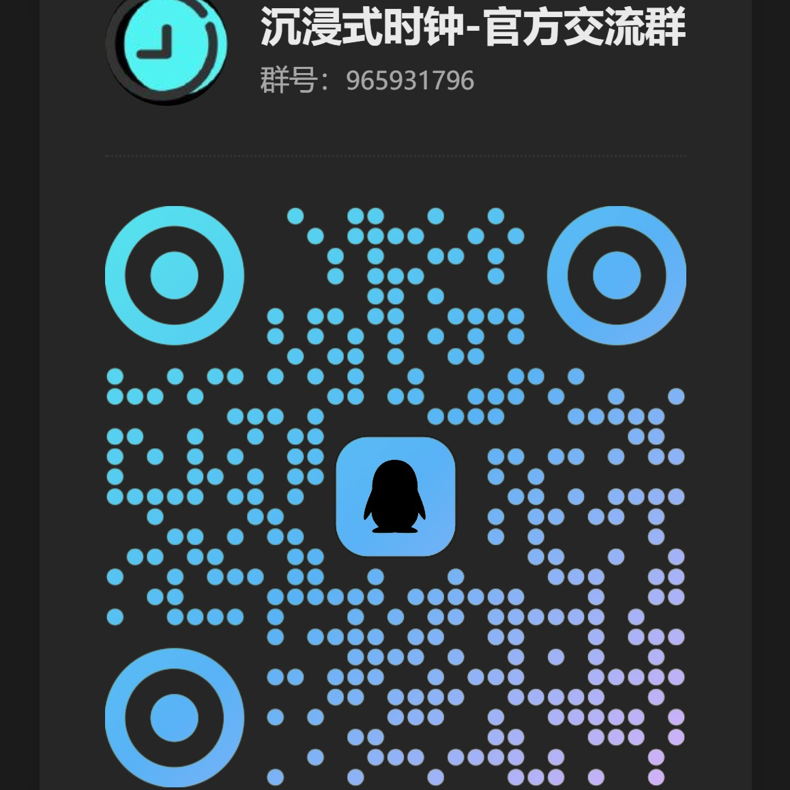

<h1 align="center">
  <br/>
  
  <br/>
  沉浸式时钟 | Immersive Clock ⏰
</h1>

<p align="center">
  <a href="https://qqhkx.com">官网</a> ｜ <a href="https://github.com/QQHKX/immersive-clock">GitHub</a> ｜ <a href="https://clock.qqhkx.com">在线体验</a> ｜ <a href="https://qm.qq.com/q/fawykipRhm">QQ 交流群</a>
</p>

<p align="center">
  简体中文 ｜ <a href="./README.en-US.md">English</a>
</p>

<div align="center">

[](LICENSE)
[](https://reactjs.org/)
[](https://www.typescriptlang.org/)
[](https://vitejs.dev/)
[](https://web.dev/progressive-web-apps/)

</div>

<div align="center">
  <strong>让时间管理更优雅，让学习更专注</strong>
</div>

<br/>

> **✈️ 文档导航**
>
> - 我是普通用户：请跳转至 [🚀 快速使用指南](#-快速使用指南)
> - 我是开发者：请跳转至 [🛠️ 开发与运行指南](#-开发与运行指南)

> **⏸️ 维护说明**
>
> 因作者高三备考，春节期间将会是高考前最后一次「大版本更新」。此后将以必要 Bug 修复为主，欢迎提交 PR，我会审核并合并。

---

## 📑 目录

- [项目概述](#-项目概述)
- [界面预览](#-界面预览)
- [快速使用指南](#-快速使用指南)
- [开发与运行指南](#-开发与运行指南)
- [主要功能](#-主要功能)
- [使用说明](#-使用说明)
- [配置与缓存](#-配置与缓存)
- [部署](#-部署)
- [无障碍支持](#-无障碍支持)
- [目录结构](#-目录结构)
- [常见问题](#-常见问题)
- [交流与反馈](#-交流与反馈)
- [贡献指南](#-贡献指南)
- [许可证与作者](#-许可证与作者)
- [Star 历史](#-star-历史)

---

## 🕒 项目概述

**沉浸式时钟（Immersive Clock）** 是一款基于 **React + TypeScript + Vite** 构建的轻量化桌面 / 网页时钟应用。  
支持时钟、倒计时、秒表与自习模式，内置天气监测、自习噪音分析、多频道励志语录、多目标倒计时轮播等实用功能。
通过 PWA 技术，支持离线使用、自动更新及桌面端安装体验。

> 适用场景：校园自习、专注学习、番茄钟、演示看板、桌面时钟等。

# 🌠 界面预览










---

## 🚀 快速使用指南

我们提供多种使用方式，满足不同场景的需求。

### 📱 方式一：PWA 应用安装（强烈推荐）

通过 PWA (Progressive Web App) 技术，您可以像原生应用一样安装本时钟，享受**离线使用**、**桌面图标启动**和**自动更新**的体验，且无需下载庞大的安装包。

**安装步骤：**

1. 使用 Chrome 或 Edge 浏览器访问 [https://clock.qqhkx.com](https://clock.qqhkx.com)。
2. 点击浏览器地址栏右侧的 **"安装 Immersive Clock"** 图标（通常是一个带有加号的小显示器图标）。
3. 确认安装后，应用将以独立窗口运行，并自动在桌面/开始菜单生成图标。

### 🌐 方式二：浏览器直接使用

如果您不想安装任何内容，可以直接访问网页版。

- **访问地址**：[https://clock.qqhkx.com](https://clock.qqhkx.com)
- **兼容性**：推荐使用 **Chrome**、**Edge** 或 **Safari** 的最新版本以获得最佳性能和动画体验。

### 💻 方式三：Electron 桌面版

如果您需要更传统的桌面软件体验（支持 .exe / .dmg / .AppImage），可以下载 Electron 打包版本。

- **下载地址**：[GitHub Releases](https://github.com/QQHKX/immersive-clock/releases)
- **安装说明**：
  - **Windows**: 下载 `.exe` 安装包并运行。
  - **macOS**: 下载 `.dmg` 文件并将应用拖入 Applications 文件夹。
  - **Linux**: 提供 `.AppImage` 或 `.deb` 包。

---

## 🛠️ 开发与运行指南

如果您想为项目贡献代码或在本地进行二次开发，请参考以下指南。

### 1. 开发环境要求

- **Node.js**: ≥ 16.0.0 (推荐 v18 LTS 或更高)
- **包管理器**: npm ≥ 8.0.0 (或 yarn / pnpm)
- **Git**: 用于代码版本控制

### 2. 项目安装步骤

```bash
# 克隆项目仓库
git clone https://github.com/QQHKX/immersive-clock.git

# 进入项目目录
cd immersive-clock

# 复制环境变量示例文件
# Windows
copy .env.example .env
# macOS/Linux
cp .env.example .env

# 安装项目依赖
npm install
```

### 3. 开发模式运行

**启动 Web 开发服务器：**

```bash
npm run dev
# 访问 http://localhost:3005
```

**启动 Electron 开发环境：**

```bash
npm run dev:electron
```

### 4. 生产构建与测试

**Web 端构建：**

```bash
# 构建生产版本
npm run build

# 预览构建产物
npm run preview
```

**Electron 端构建：**

```bash
# 构建并打包桌面安装包（输出至 release 目录）
npm run dist:electron
```

**运行测试：**

```bash
# 单元测试 (Vitest)
npm run test

# 端到端测试 (Playwright)
npm run test:e2e
```

---

## 💡 主要功能

### 🧭 时间管理模式

- **多模式切换**：时钟 / 倒计时 / 秒表 / 自习模式一键切换。
- **智能 HUD**：沉浸式交互，点击或按键显示控制栏，无操作约 8 秒自动隐藏。
- **高级倒计时**：
  - 支持单次、高考/考研目标日倒计时。
  - **多事件轮播**：支持添加多个重要日期（如四级、期末考）并按设定间隔自动轮播展示。
  - **个性化定制**：独立配置每个倒计时项的背景色、透明度与字体样式。

### 📚 学习辅助看板

- **环境感知**：
  - **实时天气**：集成和风天气 API，提供分钟级降水预警与气象灾害预警。
  - **噪音监测**：实时分贝监测，支持基线校准、最大阈值设置及超标报告自动弹窗。([🎙️ 评分系统原理](public/docs/noise-scoring.md))
- **专注氛围**：
  - **励志语录**：支持多频道源（如一言），可配置不同频道的权重与自动刷新频率。
  - **组件开关**：可自由隐藏噪音、语录、大字时间等组件，定制专属学习界面。
  - **背景定制**：支持纯色、径向渐变及上传本地图片作为背景。

### 🚀 性能与体验

- **PWA 支持**：离线缓存、桌面安装、自动更新。
- **资源优化**：静态资源（图片/字体/音频）分级缓存策略，秒级加载。
- **无障碍设计**：全键盘导航支持（Space/Enter 唤出 HUD），优化 ARIA 属性。

---

## 📘 使用说明

- **模式切换**：点击页面或按 `Space/Enter` 唤出 HUD
- **倒计时**：双击时间进入设置，支持预设时间与提示音
- **秒表**：启动、暂停、累计记录
- **自习模式**：
  - **多目标轮播**：在设置中添加多个倒计时事件，开启轮播即可自动切换。
  - **环境监测**：开启噪音监测后，超过阈值将自动记录并提示；雨雪天气会有弹窗预警。
- **设置面板**：调整目标年份、噪音基线、语录刷新间隔、自定义背景图等。

详细说明请见：

- [使用说明（中文）](docs/usage.zh-CN.md)
- [Usage Guide (English)](docs/usage.en-US.md)
- [常见问题（中文）](docs/faq.zh-CN.md)
- [FAQ (English)](docs/faq.en-US.md)

---

## 🔧 配置与缓存

- 环境变量
  - `VITE_APP_VERSION`：指定版本号（默认读取 `package.json`）

- 缓存策略
  - 图片/字体/音频：`CacheFirst`
  - 文档：`NetworkFirst`
  - 忽略版本参数 `v`，优化离线体验

---

## ☁️ 部署

```bash
# 构建后将 dist 目录上传到任意静态托管平台
# 例如：Vercel / Netlify / GitHub Pages
```

建议使用 HTTPS 以获得完整 PWA 功能。
已提供 `vercel.json` 可直接导入部署。

---

## ♿ 无障碍支持

| 操作            | 功能           |
| --------------- | -------------- |
| `Space / Enter` | 显示 HUD       |
| `Enter / Esc`   | 确认或关闭模态 |
| 双击时间        | 打开倒计时设置 |
| 触摸双击        | 移动端交互支持 |

---

## 🗂️ 目录结构

```text
immersive-clock/
├── electron/          # Electron 主进程与预加载脚本
├── public/            # 静态资源（图标、音频、PWA manifest、文档等）
├── src/               # 源码
│  ├── components/     # UI 组件（Clock, HUD, Settings 等）
│  ├── contexts/       # 全局状态管理 (Reducer/Context)
│  ├── hooks/          # 自定义 Hook（高精度计时、音频等）
│  ├── services/       # 外部服务（天气 API 等）
│  ├── utils/          # 工具函数与本地存储
│  ├── styles/         # 全局样式与变量
│  └── pages/          # 页面容器
├── tests/             # E2E 测试用例
├── docs/              # 使用说明与 FAQ
├── scripts/           # 构建后处理脚本（站点地图日期等）
├── vite.config.ts     # Vite 配置（含 PWA 与版本注入）
└── package.json       # 项目元数据与脚本
```

---

## ❓ 常见问题

- 无法定位城市？检查浏览器定位授权或使用手动刷新。
- 噪音监测无数据？确认已授权麦克风且设备支持。
- HUD 未出现？确保未打开模态框，点击页面或按 `Space/Enter`。
- 如何查看公告与更新日志？点击右下角版本号或在菜单中打开弹窗。

更多问题与解答请查看 [docs/faq.zh-CN.md](docs/faq.zh-CN.md)。

---

## 💬 交流与反馈

欢迎加入我们的官方交流群，分享使用心得、反馈 Bug 或提出功能建议。

也可以通过以下方式进行反馈（建议附上复现步骤与截图/录屏，方便快速定位）：

- QQ 群内直接反馈： [https://qm.qq.com/q/fawykipRhm](https://qm.qq.com/q/fawykipRhm)
- GitHub Issues： [https://github.com/QQHKX/immersive-clock/issues](https://github.com/QQHKX/immersive-clock/issues)
- 应用内反馈：点击右下角“版本号”打开公告弹窗 → 切到「意见反馈」
- 直接问卷链接： [https://wj.qq.com/s2/25666249/lj9p/](https://wj.qq.com/s2/25666249/lj9p/)

|   QQ 交流群   |                                     二维码                                      |
| :-----------: | :-----------------------------------------------------------------------------: |
| **965931796** |  |

---

## 🤝 贡献指南

欢迎任何形式的贡献（功能优化、Bug 修复、文档改进等）：

> 维护说明：由于作者高三备考，春节期间将会是高考前最后一次大版本更新；此后将以必要 Bug 修复为主。欢迎提交 PR，我会审核并合并。

1. Fork 仓库并创建分支
2. 保持代码风格一致、变更最小
3. 提交 PR 并附带简要说明与截图
4. 问题反馈与建议请至 [Issues](https://github.com/QQHKX/immersive-clock/issues)

---

## 📄 许可证与作者

- 许可证：MIT
- 作者：**QQHKX**
  - 🌐 [个人网站](https://qqhkx.com)
  - 💻 [GitHub](https://github.com/QQHKX)

---

## 🔗 友情链接

- [SECTL](https://sectl.top/)

---

## ⭐️ Star 历史

<div align="center">
  <a href="https://star-history.com/#QQHKX/Immersive-clock" target="_blank">
    
  </a>
</div>
